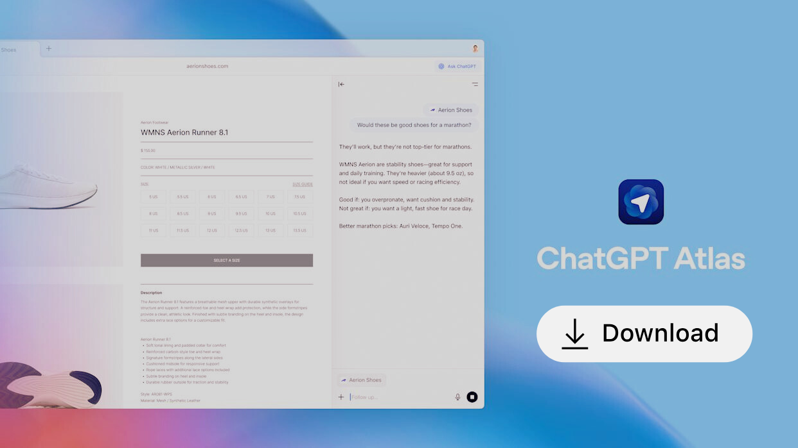

# 🌐 ChatGPT Atlas — Windows Edition

**ChatGPT Atlas** is an intelligent web browser that seamlessly integrates **ChatGPT into every webpage**, now officially available for **Windows**.  
Originally launched for macOS, Atlas now brings the same advanced **AI-driven browsing experience** to Windows users — combining context-aware assistance, memory, and automated workflows, all under your direct control.

Powered by the **Chromium engine**, Atlas ensures top-tier performance, full compatibility, and the unmatched intelligence of ChatGPT — working together for a more productive browsing experience.

  

---

## 🚀 Overview

Atlas completely transforms the way you explore the web.  
With **ChatGPT built right into the browser**, you can ask complex questions, summarize long pages, analyze information, or automate actions — all without leaving your current tab.

This Windows edition retains everything users love from the macOS release, including **Ask ChatGPT**, **Browser Memory**, and the innovative **Agent Mode**, each reengineered to deliver a fast, fluid experience on Windows.

---

## 🧠 Agent Mode

**Agent Mode** allows ChatGPT to execute real, hands-on tasks directly in your browser:

- Perform automated online research  
- Fill in forms and manage documents  
- Compare prices, products, and data  
- Handle multi-step workflows under your guidance  

You always stay in charge — actions can be paused, reviewed, or stopped instantly.

> 🧪 *Agent Mode is currently in preview for Plus, Pro, and Business plan users.*

---

## ⚙️ Engine & Compatibility

Atlas for Windows is built on the **Chromium architecture**, combining:
- **Blink** — the same rendering engine as Chrome  
- **V8** — Google’s high-speed JavaScript engine  

This guarantees full compatibility with all major web standards, while introducing an **AI-first design** focused on clarity, security, and efficiency.

---

## 🧩 Key Features

### 🆕 AI-Powered New Tab
Enter a question or URL in the **Ask ChatGPT** bar to receive instant AI-enriched results — merging search and chat into one unified experience.

### 🔎 Enhanced Search
Switch between views for **web results**, **images**, **videos**, and **news** — refining your searches beyond traditional browsing.

### 💬 ChatGPT Sidebar
Access ChatGPT instantly on any webpage to summarize, translate, or automate — without leaving the current tab.

### ✍️ Inline AI Editing
Highlight any text in an input field, click the ChatGPT icon, and improve or rewrite your content instantly — ideal for forms, emails, and online documents.

### 🧠 Browser Memory
Enable **Browser Memory** to let ChatGPT retain useful context across sessions for more tailored responses.  
You can:
- Review and remove stored pages  
- Exclude specific websites  
- Enable “Invisible Mode” for private, memory-free browsing  

### 🏠 Smart Home Recommendations
Atlas learns from your browsing habits and intelligently suggests actions — like resuming research, revisiting a previous topic, or automating frequent routines.

### 🔐 Privacy & Data Control
- Manage browsing history with per-page or bulk deletion  
- Use **Incognito Mode** to browse privately (disables memory & chats)  
- By default, browsing data **is never used for model training**  
- You may opt in to share anonymized “Web Data” for better personalization  

### 👨‍👩‍👧 Family & Parental Controls
All ChatGPT parental settings automatically apply.  
You can disable **Browser Memory** or **Agent Mode** for safer multi-user environments.

---

## 💻 Installation on Windows

> 🪟 The ChatGPT Atlas experience now comes to Windows desktops!

### 🔽 Setup Guide
1. Visit the [Releases](../../releases) page  
2. Download the **AtlasSetup.exe** installer  
3. Launch the setup and log in with your **ChatGPT account**  
4. Import your **bookmarks, passwords, and browsing history**  
5. Set **Atlas** as your default browser  
6. Enable **Ask ChatGPT** and **Browser Memory** in Settings for full functionality  

---

## 🧭 Platform Support

| Platform | Availability |
|-----------|--------------|
| macOS | ✅ Available |
| **Windows** | 🆕 Now Released |
| iOS | 🔜 Coming Soon |
| Android | 🔜 Coming Soon |

---

## 🧩 SEO & Keywords

**Keywords:**  
ChatGPT Atlas, ChatGPT browser Windows, OpenAI Atlas browser, AI web assistant, ChatGPT sidebar, AI-powered browser, intelligent Chromium browser, ChatGPT integration, ChatGPT Agent Mode, AI automation, smart browsing, OpenAI browser memory, Windows AI browser, OpenAI Atlas for Windows, ChatGPT Atlas Windows download, ChatGPT Atlas download, ChatGPT Atlas for Win, ChatGPT Atlas for Windows, ChatGPT Atlas Windows edition, ChatGPT Atlas Win setup, ChatGPT Atlas installer Windows, ChatGPT Atlas Windows version, Download ChatGPT Atlas Windows, ChatGPT Atlas Windows demo, ChatGPT Atlas AI browser Windows, OpenAI ChatGPT Atlas Windows, ChatGPT Atlas Windows free trial, ChatGPT Atlas Windows exe, ChatGPT Atlas Windows app, ChatGPT Atlas Chromium Windows, ChatGPT Atlas browser Windows, ChatGPT Atlas Windows full version, ChatGPT Atlas Windows install, ChatGPT Atlas Windows guide

**SEO Description:**  
ChatGPT Atlas — the intelligent Chromium-based browser with built-in ChatGPT — now on Windows. Experience smarter search, inline AI editing, browser memory, and real-time automation through Agent Mode for a faster, private, and more intelligent way to browse the web.

---

## 🛠️ Feedback & Contributions

We’d love to hear from you!  
Share feedback, bug reports, or feature ideas through the [GitHub Issues](../../issues) page.

---

## 📜 License

© 2025 OpenAI. All rights reserved.  
**ChatGPT Atlas — now on Windows.**  
Smarter, faster, and more intelligent web browsing powered by ChatGPT.

---
